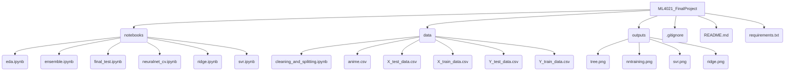

## Repository Overview

### Project Description
In this repository, we have implemented 4 different machine learning models (SVM, Neural Network, Random Forest, Ridge Regression) to attempt to predict the score of an anime show based on many different feature columns. The data used for this project was acquired from [Kaggle](https://www.kaggle.com/datasets/hernan4444/anime-recommendation-database-2020) and perfomed exploratory analysis to understand and visualize the trends directly visible. For each model, we used a validation split of the data to measure the out of sample accuracy, then saved the test data for the final evaluation of the optimized models. 

### Software and Platform
This is project was run on Python 3.11

The packages used were:
- pandas
- numpy
- matplotlib
- scikit-learn
- torch
- ipykernel

Operating Systems: MacOS/Linux and Windows

### File structure

