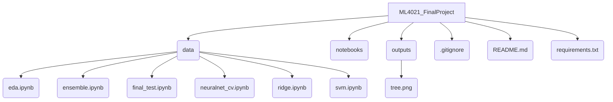

## Repository Overview

### Software and Platform
This is project was run on Python 3.11

The packages used were:
- pandas
- numpy
- matplotlib
- scikit-learn
- torch
- ipykernel

Operating Systems: MacOS/Linux and Windows

### File structure

